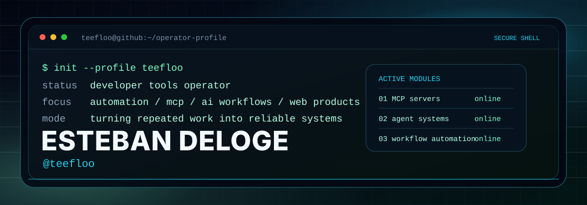
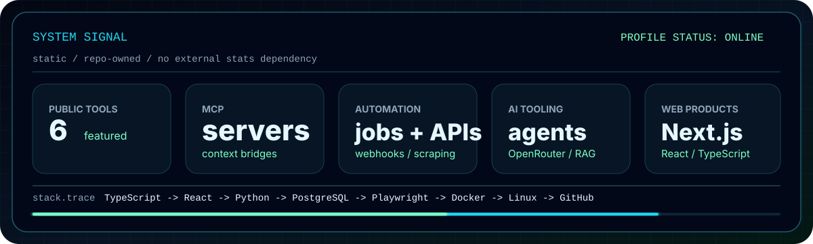

<p align="center">
  
</p>

<p align="center">
  <a href="https://github.com/teefloo">GitHub</a>
  <span> / </span>
  <a href="https://www.linkedin.com/in/esteban-deloge/">LinkedIn</a>
</p>

## ./operator

```txt
handle      teefloo
name        Esteban Deloge
mode        developer tools operator
focus       automation, MCP, AI tooling, web products
principle   build systems that keep working after the demo
```

I build practical tools for repeated work: agent systems, MCP servers, automation workflows, API bridges, scraping pipelines, and web interfaces that make complex operations easier to run.

The work I care about most lives at the edge between software and operations: clear controls, safe defaults, readable docs, and systems that can be trusted by the next person who touches them.

<p align="center">
  
</p>

## ./featured-public-systems

<table>
  <tr>
    <td width="50%" valign="top">
      <h3><a href="https://github.com/teefloo/asuswrt-mcp">asuswrt-mcp</a></h3>
      <p>Model Context Protocol server for secure AsusWRT and AsusWRT-Merlin router administration over SSH, with allowlisted operations and guarded mutations.</p>
      <p><code>Python</code> <code>MCP</code> <code>SSH</code> <code>Automation</code></p>
    </td>
    <td width="50%" valign="top">
      <h3><a href="https://github.com/teefloo/Gemini-SubAgent">Gemini-SubAgent</a></h3>
      <p>Specialized autonomous-agent library for Gemini CLI, built around high-signal terminal workflows and delegated engineering tasks.</p>
      <p><code>Agents</code> <code>CLI</code> <code>Automation</code> <code>AI Tools</code></p>
    </td>
  </tr>
  <tr>
    <td width="50%" valign="top">
      <h3><a href="https://github.com/teefloo/PolyChat-AI">PolyChat-AI</a></h3>
      <p>Multi-model AI chat interface with OpenRouter support, streaming responses, local RAG experiments, quick actions, and customizable UI modes.</p>
      <p><code>TypeScript</code> <code>React</code> <code>Vite</code> <code>OpenRouter</code></p>
    </td>
    <td width="50%" valign="top">
      <h3><a href="https://github.com/teefloo/comparateur-prix-discount">comparateur-prix-discount</a></h3>
      <p>Discount price comparison system for French retailers, combining scraping, search, scheduled data collection, and PostgreSQL persistence.</p>
      <p><code>Next.js</code> <code>Playwright</code> <code>PostgreSQL</code> <code>Scraping</code></p>
    </td>
  </tr>
  <tr>
    <td width="50%" valign="top">
      <h3><a href="https://github.com/teefloo/HA-GameGiveAways">HA-GameGiveAways</a></h3>
      <p>Home Assistant integration that monitors gaming giveaways through the GamerPower API and exposes useful sensors for automations.</p>
      <p><code>Python</code> <code>Home Assistant</code> <code>API</code> <code>Sensors</code></p>
    </td>
    <td width="50%" valign="top">
      <h3><a href="https://github.com/teefloo/PrimeDex">PrimeDex</a></h3>
      <p>High-performance Pokemon dashboard with team building, comparison tools, collection tracking, and polished frontend interactions.</p>
      <p><code>Next.js</code> <code>React</code> <code>TypeScript</code> <code>Product UX</code></p>
    </td>
  </tr>
</table>

## ./stack

<table>
  <tr>
    <td width="33%" valign="top">
      <strong>Automation layer</strong><br />
      workflow design, webhooks, scheduled jobs, scraping, REST APIs, operational checks
    </td>
    <td width="33%" valign="top">
      <strong>AI layer</strong><br />
      MCP servers, agent libraries, OpenRouter, prompt systems, local RAG experiments
    </td>
    <td width="33%" valign="top">
      <strong>Product layer</strong><br />
      TypeScript, React, Next.js, Vite, Tailwind CSS, dashboards, fast interfaces
    </td>
  </tr>
  <tr>
    <td width="33%" valign="top">
      <strong>Backend layer</strong><br />
      Node.js, Python, PostgreSQL, API design, durable data flows
    </td>
    <td width="33%" valign="top">
      <strong>Infrastructure layer</strong><br />
      Docker, Linux, SSH, GitHub, Home Assistant, deployment workflows
    </td>
    <td width="33%" valign="top">
      <strong>Quality layer</strong><br />
      Playwright, integration checks, clear documentation, maintainable handoffs
    </td>
  </tr>
</table>

## ./build-philosophy

```txt
01  start from the real workflow
02  automate the parts that create friction
03  make dangerous operations explicit
04  keep the interface fast and scannable
05  document the system like someone else will run it tomorrow
```

## ./contact

```txt
GitHub    https://github.com/teefloo
LinkedIn  https://www.linkedin.com/in/esteban-deloge/
```
