<picture>
  <source media="(prefers-color-scheme: dark)" srcset="./assets/atlas-dark.svg">
  <source media="(prefers-color-scheme: light)" srcset="./assets/atlas-light.svg">
  
</picture>

  <a href="#projets">Projets</a> ·
  <a href="#terrain">Terrain</a> ·
  <a href="#profil">Profil</a> ·
  <a href="#contact">Contact</a>

Je suis Esteban Deloge, automation engineer basé en France. Je construis des produits web, des interfaces IA et des outils qui relient données, services et appareils.

## Projets

Une sélection de projets publics. Chaque lien mène au code ou au produit lui-même.

### 01 · [Lunidex](https://github.com/teefloo/Lunidex) · [ouvrir l'app](https://lunidex.app)

Un espace Pokémon open-source qui réunit Pokédex, collection TCG, construction d'équipes, outils de combat, quiz et suivi de progression.

`TypeScript` · `Next.js` · `React` · `Expo`

### 02 · [ComparPrix](https://github.com/teefloo/comparateur-prix-discount) · [ouvrir le produit](https://comparprix.vercel.app/)

Un comparateur de prix discount qui collecte des offres, les persiste dans PostgreSQL et les publie dans une interface Next.js. Le scraping s'appuie sur Playwright et des tâches GitHub Actions.

`TypeScript` · `Next.js` · `Playwright` · `PostgreSQL`

### 03 · [PolyChat AI](https://github.com/teefloo/PolyChat-AI) · [ouvrir l'app](https://polychat-ai-xi.vercel.app)

Un studio de chat dans le navigateur pour comparer jusqu'à trois conversations de modèles en parallèle. Les fournisseurs, les clés et les sessions se configurent depuis l'interface.

`React` · `TypeScript` · `Vite` · `OpenRouter`

### 04 · [AsusWRT MCP](https://github.com/teefloo/asuswrt-mcp)

Un serveur MCP Python pour administrer des routeurs AsusWRT via SSH. Les opérations sont allowlistées, les mutations supportent le dry-run et demandent une confirmation explicite.

`Python` · `FastMCP` · `SSH`

### 05 · [MyImpots](https://github.com/teefloo/MyImpots) · [ouvrir le produit](https://myimpots.vercel.app)

Une application française qui rassemble simulateur d'impôt, frais réels, crédits d'impôt, explorateur de cases, calendrier et checklist de déclaration.

`Next.js` · `React` · `TypeScript` · `Tailwind CSS`

## Terrain

Les sujets changent. La manière de les construire reste assez stable.

- **Produits web.** Parcours de recherche, états persistants et interfaces publiques dans Lunidex, ComparPrix et MyImpots.
- **Interfaces IA.** Comparaison de modèles et exposition d'outils dans PolyChat AI et AsusWRT MCP.
- **Automatisation et données.** Scraping, workflows, stockage structuré et tâches planifiées quand un produit doit rester à jour.
- **Intégrations et outillage.** APIs, SSH contrôlé, applications mobiles et PWA quand le système doit sortir du navigateur.

## Profil

Automation engineer basé en France. La bio publique mentionne les plugins PHP/JS et les workflows n8n. Les projets récents étendent ce terrain vers Next.js, les interfaces IA, MCP, le scraping et le mobile.

- [GitHub](https://github.com/teefloo)
- [Site](https://teeflo.me/)
- [LinkedIn](https://www.linkedin.com/in/esteban-deloge/)

## Contact

[contact@teeflo.me](mailto:contact@teeflo.me) · [teeflo.me](https://teeflo.me/) · [github.com/teefloo](https://github.com/teefloo)
